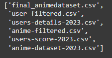
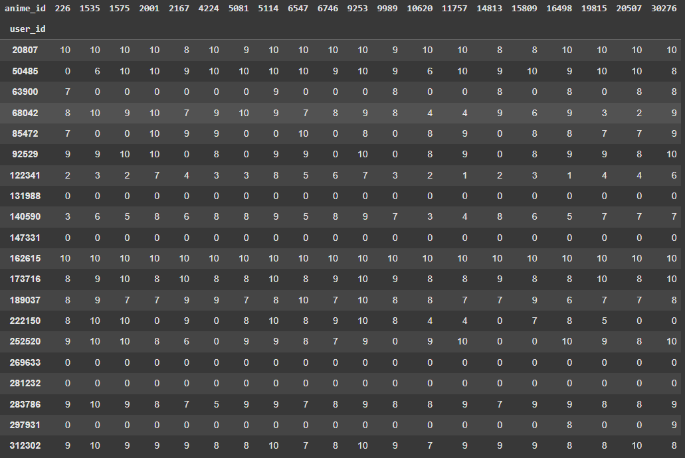
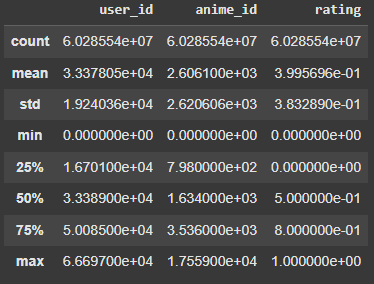
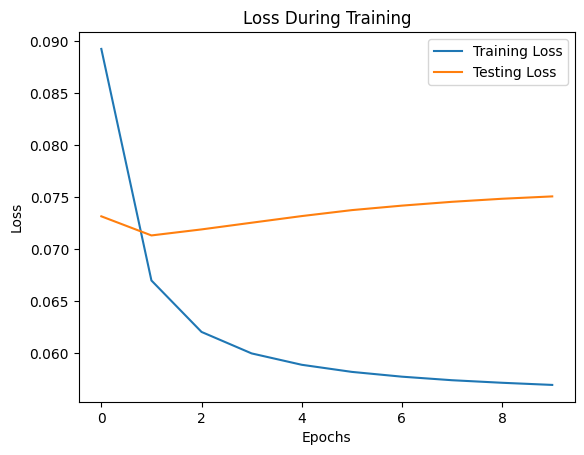
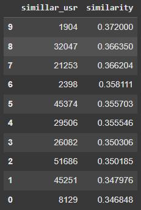
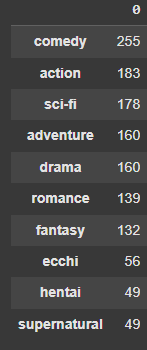
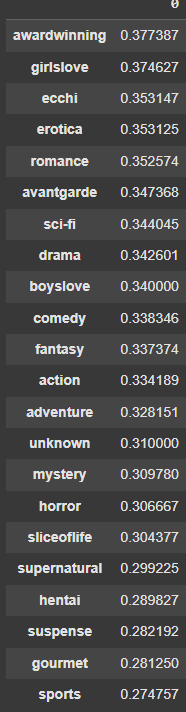
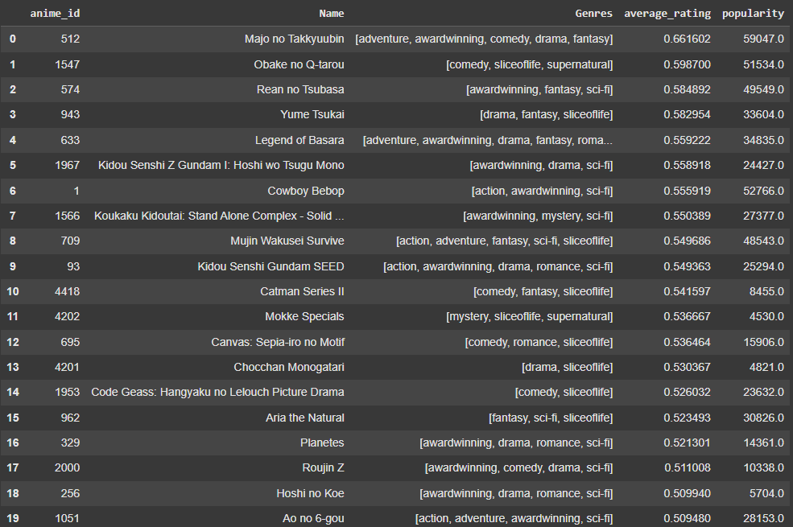
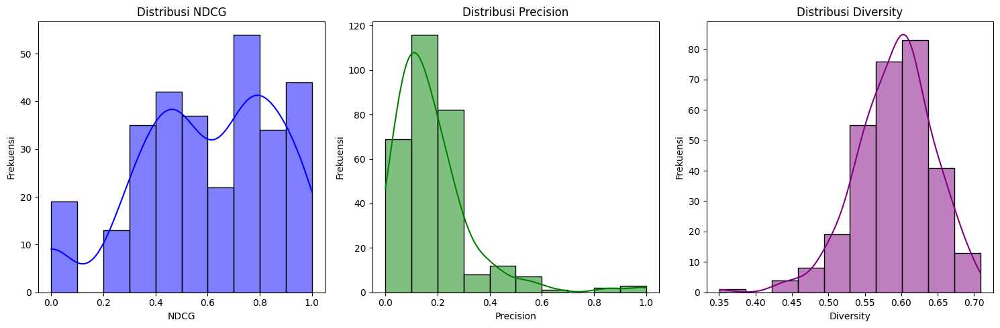

# Laporan Proyek Machine Learning - Muhamad Fahmi Ammar

## Project Overview (*Recommendation Anime Based on Genre Preferences* dengan pendekatan *Hybrid Collaborative Filtering*)

### **Latar Belakang**

Anime telah menjadi salah satu bentuk hiburan global dengan popularitas yang terus meningkat setiap tahunnya menurut **[drpress.org](https://drpress.org/ojs/index.php/HSET/article/download/15926/15449)**. Jumlah judul anime yang terus bertambah di berbagai platform streaming membuat pengguna sering kesulitan menemukan anime yang sesuai dengan preferensi mereka. Hal ini menciptakan kebutuhan akan sistem rekomendasi yang mampu memberikan pengalaman menonton yang lebih personal dan efisien.

Sistem rekomendasi berbasis **Hybrid Filtering** menjadi solusi yang efektif untuk masalah ini dengan menggabungkan kekuatan **[Collaborative Filtering](https://papers.ssrn.com/sol3/papers.cfm?abstract_id=4121831&download=yes)** dan **Content-Based Filtering**. Metode ini memungkinkan sistem untuk menemukan kemiripan antara pengguna berdasarkan pola preferensi mereka, sekaligus menganalisis genre anime favorit yang sering dipilih. Pendekatan ini dapat memberikan rekomendasi yang lebih akurat dengan mempertimbangkan genre baru yang relevan.

Proyek ini bertujuan mengembangkan sistem rekomendasi hybrid untuk anime, yang tidak hanya membantu pengguna menemukan anime sesuai selera mereka tetapi juga mengenalkan genre yang relevan berdasarkan preferensi pengguna lain yang serupa. Dengan pendekatan ini, pengalaman pengguna dalam menemukan anime diharapkan menjadi lebih menyenangkan di tengah maraknya pertumbuhan judul anime baru. 

---

## Business Understanding

Proyek ini bertujuan untuk mengembangkan sistem rekomendasi anime berbasis **Hybrid Filtering**, menggunakan dataset yang terdiri dari data anime dan data user rating. Fokus utama adalah memanfaatkan fitur-fitur kunci seperti `user_id`, `anime_id`, `rating`, `judul anime`, dan `Genres`, yang memiliki peran langsung dalam proses rekomendasi. Untuk meningkatkan performa rekomendasi, sistem akan menggunakan **embedding** untuk merepresentasikan pengguna dan anime dalam bentuk vektor di ruang berdimensi rendah, memungkinkan pengukuran kemiripan yang lebih efektif. Tantangan utamanya adalah bagaimana memanfaatkan kemiripan antar pengguna melalui embedding ini untuk memberikan rekomendasi genre anime yang relevan, sehingga sistem dapat secara efektif membantu pengguna menemukan konten sesuai preferensi mereka di tengah banyaknya pilihan anime yang tersedia.

### Problem Statements

Berikut adalah permasalahan dari proyek ini, yaitu :
- Bagaimana menangani tantangan yang mungkin muncul, seperti dataset dengan nilai yang hilang atau data sparsity, dalam proses rekomendasi?
- Bagaimana memastikan keberagaman dan relevansi rekomendasi anime yang diberikan oleh sistem?
- Bagaimana sistem rekomendasi dapat memberikan rekomendasi anime yang relevan dengan memanfaatkan kemiripan antar pengguna?

### Goals

Berikut adalah tujuan dari proyek ini, yaitu :
- Menangani tantangan yang mungkin muncul, seperti dataset dengan nilai yang hilang atau data sparsity, dalam proses rekomendasi
- Memastikan keberagaman dan relevansi rekomendasi anime yang diberikan oleh sistem
- Membuat sistem yang memberikan rekomendasi anime yang relevan dengan memanfaatkan kemiripan antar pengguna

Semua poin di atas harus diuraikan dengan jelas. Anda bebas menuliskan berapa pernyataan masalah dan juga goals yang diinginkan.

### Solution statements
Solusi yang diusulkan yaitu :
- Menangani tantangan seperti dataset dengan nilai yang hilang atau data sparsity, dalam proses rekomendasi dengan menerapkan Embedding dan teknik imputasi data untuk mengatasi masalah data yang tidak lengkap atau rating yang terlalu sedikit.
- Menggunakan metrik evaluasi seperti Diversity, Precision, dan NDCG untuk menilai sejauh mana sistem memberikan rekomendasi yang bervariasi namun tetap relevan dengan preferensi pengguna.
- Metode Hybrid Filtering menjadi pendekatan yang dapat mengintegrasikan Collaborative Filtering untuk memahami pola rating antar pengguna serta Content-Based Filtering untuk memanfaatkan informasi genre anime.

---

## Data Understanding

1. **Sumber Data**  
   Data berasal dari platform **Kaggle** dengan tautan dataset: [MyAnimeList Dataset](https://www.kaggle.com/datasets/dbdmobile/myanimelist-dataset). Dataset ini terdiri dari berbagai file dalam satu zip.

2. **Deskripsi File dalam Zip**  
   Dalam file zip terdapat enam file CSV dengan rincian:  
   - **2 CSV** untuk dataset anime 2023.  
   - **2 CSV** untuk user rating anime.  
   - **1 CSV** berisi detail user.  
   - **1 CSV** untuk final data anime rating user.
  
    

3. **Data yang Digunakan**  
   Fokus pada dua file berikut:  
   - **Anime Dataset 2023** (1 file CSV, 24,905 entri).  
   - **User Rating Dataset** (1 file CSV, 109,224,747 entri).  

   Fokus utama variabel adalah:  
   - `user_id`  
   - `anime_id`  
   - `Name` (nama anime)  
   - `rating`  
   - `Genres` (genre anime)  

4. **Deskripsi Variabel pada Anime Dataset 2023**  
   Dataset ini memiliki 24,905 entri dengan kolom-kolom berikut:  
   - `anime_id`: ID unik untuk setiap anime.  
   - `Name`: Nama asli anime.  
   - `English name`: Nama anime dalam bahasa Inggris.  
   - `Other name`: Nama alternatif anime.  
   - `Score`: Skor rata-rata anime.  
   - `Genres`: Genre anime (dalam bentuk teks).  
   - `Synopsis`: Sinopsis atau ringkasan cerita.  
   - `Type`: Tipe anime (TV, Movie, OVA, dll.).  
   - `Episodes`: Jumlah episode.  
   - `Aired`: Waktu penayangan anime.  
   - `Premiered`: Musim atau waktu awal penayangan (contoh: Spring 2023).  
   - `Status`: Status anime (Completed, Ongoing, dll.).  
   - `Producers`, `Licensors`, `Studios`: Informasi tentang pihak produksi dan distribusi.  
   - `Source`: Sumber adaptasi anime (Manga, Light Novel, dll.).  
   - `Duration`: Durasi tiap episode.  
   - `Rating`: Klasifikasi usia penonton.  
   - `Rank`: Ranking popularitas anime.  
   - `Popularity`: Tingkat popularitas.  
   - `Favorites`: Jumlah pengguna yang menambahkan anime ke favorit.  
   - `Scored By`: Jumlah pengguna yang memberikan skor.  
   - `Members`: Jumlah total anggota komunitas anime tersebut.  
   - `Image URL`: URL gambar cover anime.  

5. **Deskripsi Variabel pada User Rating Dataset**  
   Dataset ini memiliki 109,224,747 entri dengan kolom-kolom berikut:  
   - `user_id`: ID unik pengguna.  
   - `anime_id`: ID unik anime yang dirating oleh pengguna.  
   - `rating`: Skor yang diberikan pengguna pada anime (1-10).  

6. **Statistik Umum**  
   - **Total Data Anime**: 24,905.  
   - **Total Data User Rating**: 325,770 (subset dari 109,224,747 entri).  
   - **Total Anime Dirating oleh User**: 17,562.  
7. **EDA TOP ANIME dan TOP USER**
   
   Berikut adalah korelasi dari `Top Anime` dan `Top User`
   
   

    Hal yang kita dapatkan dari EDA TOP ANIME dan TOP USER adalah sebagai berikut :
    - Beberapa pengguna memberikan skor tinggi secara konsisten pada banyak anime `(contoh: user_id 20807 atau 162615)`. Ini menunjukkan bahwa pengguna tersebut cenderung sangat menyukai berbagai jenis anime atau memiliki standar penilaian yang lebih longgar.
    - Ada pengguna yang hanya memberikan rating pada sedikit anime `(contoh: 131988 atau 147331)`, menunjukkan bahwa mereka mungkin hanya menonton anime tertentu atau lebih selektif dalam memberikan rating.
    - Kolom yang memiliki banyak nilai tinggi `(contoh: anime_id 226 dan 30276)` menunjukkan bahwa anime tersebut sangat dihargai oleh berbagai pengguna. Hal ini bisa menjadi indikator popularitas atau kualitas tinggi.
    - Beberapa anime memiliki distribusi rating yang sangat bervariasi `(contoh: 9989)`. Hal ini menunjukkan bahwa anime tersebut mungkin memiliki daya tarik yang spesifik, tergantung pada preferensi individu pengguna.
    - Beberapa pengguna hanya memberikan rating tinggi pada anime tertentu `(contoh: 147331 pada 30276)`. Ini menunjukkan preferensi yang spesifik dan bisa menjadi indikator rekomendasi untuk kelompok pengguna serupa.
    - Jika pengguna tertentu (misalnya, 20807) memberikan nilai tinggi pada banyak anime populer `(contoh: 226, 30276)`, ini menunjukkan bahwa preferensi mereka sejalan dengan tren umum.
   
## Data Preparation

Dataset yang digunakan adalah **Anime-dataset-2023** dan **User-rating**. Fokus utama dari data preparation adalah untuk memastikan data bersih, relevan, dan siap diproses lebih lanjut.

1. **Mengatasi Data Noise**  
   - **Data Duplicate**:  
     Dilakukan pengecekan data duplikat pada dataset **user_rating_df**, dan ditemukan 1 data duplikat. Data tersebut dihapus menggunakan `drop_duplicates()` untuk memastikan data bersih dan tidak redundant.

2. **Selected Features pada Anime Data**  
   - Mengingat fokus analisis adalah pada variabel **anime_id**, **Name**, dan **Genres**, maka hanya fitur-fitur tersebut yang dipilih untuk digunakan dalam sistem.  
     ```python
     selected_feature = ['anime_id', 'Name', 'Genres']
     anime_df = anime_df[selected_feature]
     ```

3. **One-Hot Encoding Genre pada Anime Data**  
   - Genre dipecah menjadi beberapa kolom bernilai boolean (0 atau 1), sehingga data lebih mudah diproses dalam sistem.
   - **Tahapan yang dilakukan**:
     - **Text Processing**: Membersihkan teks dengan mengubah menjadi huruf kecil (*lower case*) dan menghapus spasi tambahan (*remove spacing*).
     - **Splitting Genre**: Memisahkan genre berdasarkan tanda koma (`,`).
     - **One-Hot Encoding**: Menggunakan **MultiLabelBinarizer** untuk melakukan encoding.
     - **Menggabungkan Hasil Encoding dengan Data Asli**: Data hasil encoding digabungkan kembali ke dataset **anime_df**.
   - **Hasil Akhir Dataset**:
     Dataset kini memiliki kolom tambahan berupa genre (misalnya: `action`, `adventure`, dll.) dengan nilai boolean. Contoh struktur dataset setelah proses:
     ```Data columns (total 25 columns):
        #   Column        Non-Null Count  Dtype 
        ---  ------        --------------  ----- 
        0   anime_id      24905 non-null  int64 
        1   Name          24905 non-null  object
        2   Genres        24905 non-null  object
        3   action        24905 non-null  int64 
        4   adventure     24905 non-null  int64 
        5   avantgarde    24905 non-null  int64 
        6   awardwinning  24905 non-null  int64 
        7   boyslove      24905 non-null  int64 
        8   comedy        24905 non-null  int64 
        9   drama         24905 non-null  int64 
        10  ecchi         24905 non-null  int64 
        11  erotica       24905 non-null  int64 
        12  fantasy       24905 non-null  int64 
        13  girlslove     24905 non-null  int64 
        14  gourmet       24905 non-null  int64 
        15  hentai        24905 non-null  int64 
        16  horror        24905 non-null  int64 
        17  mystery       24905 non-null  int64 
        18  romance       24905 non-null  int64 
        19  sci-fi        24905 non-null  int64 
        20  sliceoflife   24905 non-null  int64 
        21  sports        24905 non-null  int64 
        22  supernatural  24905 non-null  int64 
        23  suspense      24905 non-null  int64 
        24  unknown       24905 non-null  int64 

     ```

4. **Membatasi Data pada User Rating**  
   - Untuk efisiensi, dilakukan pembatasan data **user_rating** dengan memilih pengguna yang telah memberikan minimal **500 rating**.  
   - **Code** :
        ```python
        n_ratings = user_rating_df.user_id.value_counts()
        get_index =  n_ratings[n_ratings >= 500].index
        user_rating_df = user_rating_df[user_rating_df['user_id'].isin(get_index)].copy()
        user_rating_df.info(show_counts=True)
        ```
   - **Hasilnya**:
     - Jumlah **user** setelah pembatasan: **66,698 user**.
     - Jumlah **anime** yang dirating: **17,560 anime**.

5. **Membangun Encode-Decode untuk anime_id dan user_id**  
   - ID dari **user_id** dan **anime_id** diubah menjadi bentuk numerik dengan rentang:
     - **user_id**: 0 hingga jumlah total user.
     - **anime_id**: 0 hingga jumlah total anime.  
   - Tujuan dari proses ini adalah untuk:
     - Mengoptimalkan proses komputasi.
     - Mempermudah pengolahan data dalam sistem.

6. **Normalisasi Rating**  
   - Nilai rating diubah menjadi rentang **0-1** dengan normalisasi.  
   - **Tujuan**:
     - Menjaga nilai rating berada dalam skala kecil.
     - Memastikan sistem dapat memproses nilai secara efisien tanpa bias karena skala yang besar.
   - **Hasil** :
    Pada data rating memiliki nilai `minimal = 0` dan `maksimal = 1`

        

7. Data Split (Training dan Testing)  
Data dibagi menjadi 80% untuk training dan 20% untuk testing. Pembagian ini memastikan model dapat dilatih dengan data yang cukup besar sambil tetap menyediakan data untuk evaluasi yang valid. 

#### **Hasil Data Preparation**
Tahapan **Data Preparation** yang dilakukan memastikan bahwa dataset sudah:
- Bersih dari noise seperti missing value dan duplikasi.
- Fokus hanya pada fitur-fitur yang relevan.
- Siap digunakan untuk analisis dan pemodelan dengan struktur data yang teroptimasi (normalisasi rating, one-hot encoding, dan encode/decode ID). 


## Modeling
Alur modeling sistem rekomendasi ini melibatkan beberapa tahap kunci, yaitu pembuatan embedding untuk merepresentasikan user dan item, pembagian data menjadi training dan testing, penggunaan TPU untuk mempercepat proses training, pelatihan model embedding, dan ekstraksi hasil model untuk digunakan dalam sistem rekomendasi. Model ini bertujuan merekomendasikan anime berdasarkan preferensi genre dari user yang memiliki kesamaan preferensi.

### Embedding  
Pada tahap ini, saya menggunakan model embedding yang dapat merepresentasikan hubungan antara user dan item dalam bentuk vektor berdimensi rendah. Embedding sering digunakan dalam sistem rekomendasi karena mampu menangkap pola laten yang tidak terlihat dalam data asli, seperti preferensi user terhadap genre tertentu. **[Menurut jurnal "Neural Collaborative Filtering" oleh He et al.](https://arxiv.org/abs/1708.05031)**, embedding efektif untuk menangkap fitur laten user dan item.  

**Kelebihan embedding**:  
1. Efisien dalam menangani data sparsity pada sistem rekomendasi.  
2. Mempercepat proses komputasi dengan dimensi data yang lebih rendah.  
**Kekurangan embedding**:  
1. Membutuhkan hyperparameter tuning yang tepat agar hasil optimal.  
2. Memerlukan dataset besar agar performa model maksimal.  

**Arsitektur Embedding Model** :


| **Layer (type)**           | **Output Shape**         | **Param #**  |
|----------------------------|--------------------------|--------------|
| user_input (InputLayer)    | [(None, 1)]             | 0            |
| anime_input (InputLayer)   | [(None, 1)]             | 0            |
| user_embedding (Embedding) | (None, 1, 128)          | 8537344      |
| anime_embedding (Embedding)| (None, 1, 128)          | 2247680      |
| flatten_2 (Flatten)        | (None, 128)             | 0            |
| flatten_3 (Flatten)        | (None, 128)             | 0            |
| dot_1 (Dot)                | (None, 1)               | 0            |
| **Total params**           | **10785024 (41.14 MB)** |              |
| **Trainable params**       | **10785024 (41.14 MB)** |              |
| **Non-trainable params**   | **0 (0.00 Byte)**       |              |

### Parameter Model  
- **Loss function**: Mean Squared Error (MSE)  
- **Optimizer**: Adam  
- **Learning rate (lr)**: 0.001  

### Setup TPU  
Dataset yang digunakan memiliki ukuran besar sehingga pelatihan membutuhkan waktu lama jika dilakukan di CPU/GPU biasa. Dengan menggunakan TPU (TPU V28 dari Google Colab), proses pelatihan menjadi lebih cepat dan efisien. TPU dirancang untuk menangani operasi tensor skala besar seperti embedding.

### Training Embedding  
Untuk melatih model embedding:  
1. Gunakan `tpu_strategy.scope()` agar pelatihan berlangsung di TPU.  
2. Input data berupa `train_users` dan `train_animes`, dengan target `train_ratings`.  
3. **Parameter pelatihan**:  
   - Batch size: 3096 (lebih besar karena menggunakan TPU).  
   - Epochs: 10.  
   - Validation data: `[test_users, test_anime]` dengan target `test_ratings`.  
4. Proses pelatihan disimpan dalam variabel `history` untuk evaluasi.
5. Hasil Training Loss dan testing loss saat training:

   

   Dari grafik tersebut menunjukan bagaimana model dapat berlatih dengan baik dalam menurunkan error. 

### Save Model  
Model disimpan dalam format `embedding_model.h5`. Hal ini menghemat waktu karena tidak perlu melakukan pelatihan ulang jika model perlu digunakan kembali.

### Extract Model  
Untuk sistem rekomendasi, bobot embedding diekstrak menggunakan fungsi `extract_weights`. Bobot ini meliputi:  
- `anime_weights`: representasi vektor dari setiap anime.  
- `user_weights`: representasi vektor dari setiap user.  

### Find Similar User  
Pencarian user yang mirip dilakukan dengan menghitung jarak antar vektor `user_weights` menggunakan dot product.  
- Urutkan user berdasarkan jarak dari yang terdekat hingga terjauh.  
- Simpan hasilnya dalam array `similarity` berisi daftar user terdekat dan tingkat kemiripannya.

Hasil dari pencarian User yang mirip adalah sebagai berikut:
   
   

### Find Favorite Genres User  
Sistem rekomendasi hybrid memanfaatkan genre favorit user. Genre favorit dihitung berdasarkan anime yang telah dirating tinggi oleh user, lalu dirata-rata berdasarkan genre.

Hasil dari pencarian favorit genre user adalah sebagai berikut:

   

### Find Favorite Genres Based on Similar Users  
Kemiripan antar user digunakan untuk merekomendasikan genre lain. Genre dihitung berdasarkan rating anime yang telah dirating user mirip, lalu dirata-rata. Genre dengan rating tertinggi diprioritaskan untuk rekomendasi.

Hasil dari pencarian Genre berdasarkan kemiripan User  :

   

### Recommendation Based on Genre Preferences (Hybrid Collaborative Filtering)  
Rekomendasi dilakukan dengan langkah-langkah:  
1. Identifikasi genre favorit user.  
2. Temukan user yang mirip.  
3. Hindari anime yang sudah dirating oleh user.  
4. Filter 3 genre dengan rata-rata rating tertinggi untuk rekomendasi.  
5. Pastikan anime yang direkomendasikan memiliki setidaknya satu genre yang sesuai.  
6. Pilih anime yang belum dirating oleh user.  
7. Hitung rata-rata rating dan popularitas dari anime yang belum dirating.  
8. Berikan 10 rekomendasi dalam format pandas DataFrame:  
   - **Kolom**: `anime_id`, `Name anime`, `Genres`, `Average Rating`, `Popularity`.  

Semisal saya ingin melakukan rekomendasi berdasarkan user `11165`  untuk membuat rekomendasi nya adalah dengan menggunakan kode berikut:
```python
   user_id = 11165  # Replace with actual user_id

recommended_anime = recommend_anime_for_user(
    user_id=user_id,
    rating_data=user_rating_df,
    anime_data=anime_df,
    top_n=20,
    sort_by='average_rating'
)
```
Hasil dari sistem rekomendasi tersebut adalah sebagai berikut:

   

## Evaluation


### Evaluasi Prediksi Rating
Evaluasi prediksi rating dilakukan untuk mengukur seberapa baik model embedding dalam memprediksi rating antara pengguna dan item (dalam hal ini, anime). Penggunaan MSE (*Mean Squared Error*) sebagai metrik evaluasi menunjukkan seberapa besar rata-rata kesalahan kuadrat antara nilai rating sebenarnya dengan prediksi. Hasil MSE sebesar **0.07505408284875245** menunjukkan bahwa model memiliki performa yang cukup baik untuk digunakan dalam sistem rekomendasi, karena kesalahan prediksinya kecil.

### Evaluasi Sistem Rekomendasi Hybrid
Evaluasi sistem rekomendasi bertujuan untuk menilai kualitas rekomendasi yang dihasilkan oleh model dalam berbagai aspek, menggunakan 300 data sampel dengan jumlah rekomendasi sebanyak 20 item. Tiga metrik yang digunakan adalah:

1. **Precision**  
   [Precision](https://www.mdpi.com/2504-3900/2/18/1178/pdf) mengukur proporsi rekomendasi yang relevan dari total item yang direkomendasikan. Tujuannya adalah untuk memastikan bahwa sistem memberikan rekomendasi yang sesuai dengan preferensi pengguna. Precision yang tinggi berarti model efektif dalam memberikan rekomendasi yang benar-benar berguna bagi pengguna.

2. **Diversity**  
   [Diversity](https://www.mdpi.com/2504-3900/2/18/1178/pdf) mengukur seberapa beragam item yang direkomendasikan oleh sistem. Tujuan dari metrik ini adalah untuk memastikan pengguna mendapatkan rekomendasi yang tidak monoton atau seragam, sehingga meningkatkan kepuasan dan eksplorasi pengguna terhadap berbagai jenis item.

3. **NDCG (Normalized Discounted Cumulative Gain)**  
   [NDCG](https://www.mdpi.com/2504-3900/2/18/1178/pdf) mengukur relevansi rekomendasi dengan memperhitungkan posisi item dalam daftar rekomendasi. Item yang lebih relevan di posisi awal daftar memberikan kontribusi lebih tinggi terhadap skor NDCG. Tujuannya adalah memastikan bahwa rekomendasi yang paling relevan ditempatkan di urutan teratas untuk meningkatkan efisiensi dan kenyamanan pengguna saat menerima rekomendasi.

### Visualisasi Evaluasi



Dari visualisasi yang ditampilkan, berikut adalah deskripsi berdasarkan metrik **NDCG**, **Precision**, dan  **Diversity**:

1. **Distribusi NDCG**  
   Histogram pada grafik NDCG menunjukkan bahwa sebagian besar nilai NDCG berada di kisaran 0.4 hingga 0.8, dengan puncak frekuensi di sekitar 0.6. Hal ini mengindikasikan bahwa sistem rekomendasi berhasil memberikan item yang relevan dalam urutan yang cukup baik. NDCG yang tinggi mencerminkan bahwa item-item relevan ditempatkan di posisi awal dalam daftar rekomendasi, sehingga meningkatkan kepuasan pengguna.

2. **Distribusi Precision**  
   Grafik distribusi Precision menunjukkan bahwa sebagian besar nilai precision berada di kisaran 0.1 hingga 0.3, dengan frekuensi tertinggi sekitar 0.2. Ini berarti bahwa meskipun sistem dapat merekomendasikan beberapa item yang relevan, proporsi rekomendasi yang benar-benar relevan terhadap total rekomendasi masih relatif rendah. Hal ini mungkin disebabkan oleh kompleksitas data atau keterbatasan model dalam memahami preferensi pengguna secara mendalam.

3. **Distribusi Diversity**  
   Grafik distribusi Diversity memperlihatkan bahwa sebagian besar nilai diversity berkisar antara 0.55 hingga 0.65, dengan frekuensi tertinggi sekitar 0.6. Hal ini menunjukkan bahwa sistem rekomendasi mampu memberikan rekomendasi yang cukup beragam. Keberagaman ini penting untuk memastikan bahwa pengguna tidak hanya menerima rekomendasi yang seragam, melainkan juga eksplorasi item yang berbeda sesuai dengan preferensinya.

### Kesimpulan  
Proyek *Recommendation Anime Based on Genre Preferences* dengan pendekatan *Hybrid Collaborative Filtering* berhasil menangani berbagai tantangan yang dihadapi dalam sistem rekomendasi, seperti data sparsity dan nilai yang hilang, dengan menerapkan teknik *embedding* serta imputasi data. Evaluasi menggunakan metrik MSE menunjukkan bahwa pendekatan ini efektif untuk mengatasi keterbatasan data, menghasilkan model yang cukup andal untuk memberikan rekomendasi yang relevan. Selain itu, penerapan *Hybrid Filtering* yang menggabungkan *Collaborative Filtering* untuk analisis pola rating antar pengguna dan *Content-Based Filtering* untuk memanfaatkan informasi genre, memberikan hasil yang seimbang antara relevansi dan keberagaman rekomendasi.

Hasil evaluasi menunjukkan performa yang baik dalam berbagai aspek. NDCG yang mayoritas berada di kisaran 0.4 hingga 0.8 mencerminkan bahwa sistem mampu memberikan rekomendasi yang relevan dan terurut dengan baik, meningkatkan kepuasan pengguna. Precision, meskipun rata-rata berada di kisaran rendah (0.1 hingga 0.3), tetap menunjukkan kemampuan sistem dalam memberikan item yang relevan, meski perlu perbaikan untuk meningkatkan akurasi lebih jauh. Selain itu, tingkat keberagaman yang cukup tinggi (dengan *diversity* berkisar 0.55 hingga 0.65) menunjukkan bahwa sistem tidak hanya memberikan rekomendasi yang relevan tetapi juga beragam, memastikan pengalaman pengguna yang lebih menarik dan bervariasi. Hal ini membuktikan bahwa pendekatan hybrid ini mampu menangkap kebutuhan pengguna secara lebih holistik.

Referensi :
- [Chen, J. (2024). The Investigation on Anime-Themed Recommendation Systems. Highlights in Science, Engineering and Technology, 81, 121-131.](https://drpress.org/ojs/index.php/HSET/article/download/15926/15449)
  
- [Zeng, Z., Zhang, Z., Zhang, D., & Chan, T. (2024). The impact of recommender systems on content consumption and production: Evidence from field experiments and structural modeling. Available at SSRN.](https://papers.ssrn.com/sol3/Delivery.cfm?abstractid=4915562)

- [My Anime List 2023 Dataset](https://www.kaggle.com/datasets/dbdmobile/myanimelist-dataset)

-  [He, X., Liao, L., Zhang, H., Nie, L., Hu, X., & Chua, T. S. (2017, April). Neural collaborative filtering. In Proceedings of the 26th international conference on world wide web (pp. 173-182).](https://arxiv.org/abs/1708.05031)

- [Landin, A., Suárez-García, E., & Valcarce, D. (2018, September). When diversity met accuracy: a story of recommender systems. In Proceedings (Vol. 2, No. 18, p. 1178). MDPI.](https://www.mdpi.com/2504-3900/2/18/1178/pdf)
